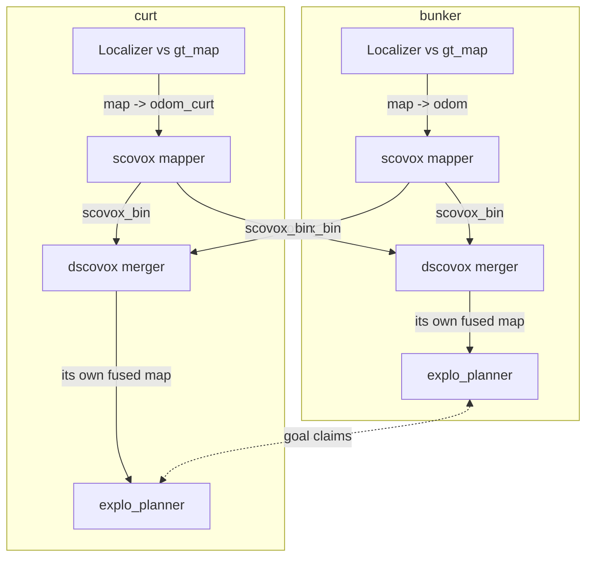

# Explo planner + SCovox on the Jetson: runtime results

As of 2026-09-29. Dev Jetson Orin, 12 cores. All runs open loop on the two
120 s localisation bags (`bunker_jetson`, `curtmini_jetson`).

## Summary

The simultaneous two-robot runs (`dual_r1`–`r3`, 2026-09-29) worked every
time: both mergers fused both robots' maps, the planners coordinated, and
neither localizer diverged. The three runs agree to about 1%. Per-robot mapper
cost was the same as in the single-robot pinned runs.

| Date | Run | Robots | Runs | Outcome |
| --- | --- | --- | --- | --- |
| 2026-09-29 | `dual_r1`–`r3` | bunker + curt together | 3 | Works; fusion `sources=2`, coordination active, 0 divergences |
| 2026-09-18 | `pin_*`, `pin1_*` | bunker or curt, one at a time | 12 | Mapper within budget; repeats agree to about 1% |
| 2026-09-13 | `explo_curt*` | curt only | 3 | Planner works; SCovox 18x over budget at res 0.10, localizer diverged 8 times |

- **Running two robots does not slow either mapper.** bunker's scovox frame p50
  was 89.2 ms (single-robot `pin1`: 87.4 ms), curt's 71.5 ms (69.6 ms).
- **bunker integrates only about 7.6 of its 10 Hz scans, alone or with curt.**
  Its p95 frame (about 104 ms) sits just over the 100 ms budget. curt keeps up
  at 10 Hz.
- **The planner is cheap.** Plan time is 175–250 ms per step and average CPU is
  0.07 cores. The average only reflects the open-loop duty cycle.
- **The dual run changed the DDS as well as the robot count**: FastDDS over
  shared memory, against CycloneDDS over UDP in the pinned runs. CPU
  differences between the two are not attributable to the second robot alone.

## Two-robot setup

Each robot runs its own full stack, and the only things crossing between robots
are the mappers' binary map deltas and the planners' goal claims, as over a
real radio link. Runner: [`ws/src/run_explo_dual_native.sh`](../ws/src/run_explo_dual_native.sh),
a native port of the Docker-only `run_explo_dual.sh` (this box has no Docker
images and none of the original raw bags).



Per robot (namespaced `/bunker` and `/curt`):

1. `lidar_localization` (SMALL_VGICP against the shared `gt_map_us050`)
   publishes `map -> odom_R`, with an identity static `odom_R -> base_R`.
2. `scovox_node` (rolling mode, res 0.20, full-ray carve, deskew on, config
   `bunker_jetson.yaml`) integrates into its own identity alias of `map`
   (`map_int_R`), which becomes its source key in the mergers.
3. `dscovox_node` subscribes to **both** robots' `scovox_bin` streams, so each
   robot holds its own fused copy of the world.
4. `explo_planner_R` reads only its own robot's merger, with
   `coordination_enabled` so it sees the other robot's claimed goal.

**One clock.** The two bags were recorded 1626.677 s apart, and only one player
may publish `/clock`. [`ws/src/restamp_bag_onto.py`](../ws/src/restamp_bag_onto.py)
shifts the bunker bag onto curt's timeline: log times, header stamps, TF, and
the Hesai per-point `timestamp` field, which holds absolute times. After the
shift both bags start on the same nanosecond; the geometry bytes were checked
identical. curt drives `/clock`; both play at rate 1.0.

```bash
B=~/jetbot-slam/hmr_localisation/bags
python3 ws/src/restamp_bag_onto.py $B/bunker_jetson $B/curtmini_jetson $B/bunker_jetson_on_curt_clock
ws/src/run_explo_dual_native.sh dual_r1          # DDS=cyclone for CycloneDDS
```

**DDS.** FastDDS with `hmr_localisation/config/fastdds_shm.xml`: shared-memory
transport, 64 MB segment. The pinned single-robot runs used CycloneDDS over UDP.

**Pinning** (12 cores; both bag players share cores 10–11):

| Robot | Localizer | scovox | dscovox | planner |
| --- | --- | --- | --- | --- |
| bunker | 0–1 | 2 | 3 | 4 |
| curt | 5–6 | 7 | 8 | 9 |

**Open loop.** Each robot replays its recorded path; the planners' goals are
never followed. The runs test candidate generation, scoring, fusion and
coordination, not goal quality.

## Two-robot results (dual_r1–r3)

Both robots mapped, fused and planned for the full 120 s in all three runs,
with no localization divergence. The runs agree to about 1%, as tight as the
pinned single-robot rounds. Values are 3-run means, with the range across runs
where it is worth seeing.

| Measure | bunker | curt |
| --- | --- | --- |
| Scans integrated (Hz of 10) | 7.58 (7.56–7.60) | 10.02 (10.01–10.02) |
| scovox frame p50 (ms) | 89.2 (88.9–89.6) | 71.5 (71.3–71.7) |
| scovox frame p95 (ms) | 105.0 (104.7–105.5) | 97.4 (94.7–102.4) |
| scovox frame max (ms) | 112–154 | 237–246 |
| Merger fused voxels (of contributed) | 1.10 M (of 1.58 M) | 1.07 M (of 1.55 M) |
| Planner steps (CSV rows) | 5 in every run | 4 in every run |
| Plan time p50 (ms) | 200 | 225 (224–250) |
| Planner observed voxels, last step | 224 k | 224 k |
| Localizer (cores avg; peak RSS MB) | 1.03; 252–256 | 1.11; 228–233 |
| scovox (cores avg; peak RSS MB) | 0.82; 313–320 | 0.84; 230–241 |
| dscovox (cores avg; peak RSS MB) | 0.28; 348–366 | 0.31; 314–349 |
| Planner (cores avg / peak; peak RSS MB) | 0.06 / 0.52–0.62; 304–309 | 0.08 / 0.53–0.58; 300–303 |
| Localization divergences | 0 in every run | 0 in every run |

Per-run outputs are in `~/explo-output/dual/dual_r{1,2,3}_{bunker,curt}.*`.

**Fusion.** Both mergers reported `sources=2` from the first diagnostic onward
in every run. Contributed voxels exceed fused voxels by about 30%: the two maps
land on the same cells, so they are co-registered in one `map` frame.

**Coordination.** Identical in all three runs. At step 0 neither planner had
seen the other (`peers=0`), and they picked goals 0.4 m apart. From step 1 both
saw `peers=1` and rejected candidates the other had claimed (`blk` up to 32–33
per step for bunker, 3 for curt). The goals then split: bunker's moved west,
from (7.6, −2.4) to (−1.5, 0.2), and curt's north, from (7.9, −2.6) to
(9.8, 7.8).

**Memory.** The two-robot stack peaks at about 2.3 GB RSS across the eight
nodes.

## Against the single-robot pinned runs

Per-robot mapping cost in the dual runs matches the later single-robot round
(`pin1`) within about 2 ms of frame time. The merger's CPU fell by more than
half even though it now folds two streams; the DDS change is the likely cause,
but this has not been isolated.

The pinned runs (2026-09-18, runner [`ws/src/run_explo_pinned.sh`](../ws/src/run_explo_pinned.sh))
ran one robot at a time, 3 repeats per bag per round, CycloneDDS over UDP.
All columns are 3-run means; repeats agree to about 1% in every group.

| Measure | bunker pin | bunker pin1 | bunker dual | curt pin | curt pin1 | curt dual |
| --- | --- | --- | --- | --- | --- | --- |
| Scans integrated (Hz of 10) | 7.14 | 7.65 | 7.58 | 9.43 | 9.99 | 10.02 |
| scovox frame p50 (ms) | 95.6 | 87.4 | 89.2 | 75.2 | 69.6 | 71.5 |
| scovox frame p95 (ms) | 125.1 | 104.1 | 105.0 | 110.3 | 111.5 | 97.4 |
| Localizer (cores) | 1.38 | 0.90 | 1.03 | 1.41 | 0.87 | 1.11 |
| scovox (cores) | 0.93 | 0.89 | 0.82 | 0.91 | 0.81 | 0.84 |
| dscovox (cores) | 0.76 | 0.77 | 0.28 | 0.61 | 0.61 | 0.31 |
| Planner steps (CSV rows) | 4 | 4 | 5 | 5 | 5 | 4 |
| Planner observed voxels, last step | 156 k | 159 k | 224 k | 201 k | 211 k | 224 k |
| Localization divergences | 0 | 0 | 0 | 0 | 0 | 0 |

- **bunker's 7.6 Hz is not caused by the dual setup.** With two scovox cores
  and one robot, `pin1` admitted the same 7.65 Hz.
- **Each planner sees more map in the dual runs** (224 k observed voxels,
  against 159 k and 211 k alone), because its merger holds both robots'
  contributions.
- **The localizer used 14–28% more CPU** than in `pin1`. The DDS and the
  second localizer changed at once, so this cannot be pinned on either.
- **`pin` and `pin1` differ** (localizer 1.4 against 0.9 cores; bunker frame 96
  against 87 ms). The change between the two rounds is not recorded in the
  output files.

## Why bunker's scans take longer than curt's

bunker's frames average 89.5 ms against curt's 73.9 ms (3-run means; each run
within 0.6 ms of that), and almost all of the gap is the ray walk. The Hesai gives the mapper about 19% more rays
per scan than the Ouster. The scenes are not the cause: mean ray length is the
same on both bags.

Stage means over all frames of `dual_r1` (from the mapper's per-frame log; `r2` and `r3` are within 0.6 ms on every stage):

| Stage | bunker | curt | Difference |
| --- | --- | --- | --- |
| Ray walk + carve (`tsdf_ms`; TSDF itself is off) | 73.7 ms | 55.7 ms | +18.0 ms |
| Downsample, deskew, other integrate | 15.5 ms | 13.7 ms | +1.8 ms |
| TF lookup | 0.1 ms | 4.6 ms | −4.5 ms |
| Whole frame | 89.3 ms | 73.9 ms | +15.4 ms |

Per-scan input, measured on 50 scans from each bag with the mapper's range
gate (1–20 m) and a 0.2 m voxel downsample:

| Per scan | bunker (Hesai, 128 ch) | curt (Ouster) |
| --- | --- | --- |
| Raw points in the message | 230,400 | 131,072 |
| Returns inside 1–20 m | 111,000 | 103,500 |
| Points after the 0.2 m downsample (rays traced) | 26,400 | 22,400 |
| Mean ray length | 11.2 m | 11.1 m |
| Voxel steps walked | 1.48 M | 1.24 M |

- **More rays, not longer ones.** Both sensors return a similar number of
  usable points, but the Hesai's denser beam pattern spreads them over 18% more
  0.2 m voxels, and the mapper traces one ray per occupied voxel.
- **The extra rays explain about 10.6 of the 18 ms** (19% more steps at curt's
  cost per step).
- **About 7 ms is unexplained.** Each voxel step costs 11% more on bunker
  (49.8 ns against 44.8 ns). One untested candidate is bunker's larger map
  (peak RSS 320 against 235 MB) causing more cache misses per lookup.
- **The Hesai message has about 97,000 empty slots** (230,400 slots, 133,000
  non-zero returns). The mapper still loops over them, which is part of the
  +1.8 ms pre-processing.
- **curt waits about 4.5 ms per frame for its pose**, which narrows the gap.

bunker's p95 frame (about 104 ms) sits just over the 100 ms budget, which is
why it drops about a quarter of its scans. Levers that cut the ray count: a
slightly larger `downsample_voxel_size` for bunker, or a `max_range` below
20 m, each at some cost in map density or reach.

## Earlier CURT-only run (2026-09-13)

The first explo_planner + SCovox run showed the planner working but SCovox
running 18x over its real-time budget. Its numbers do not compare with the
later rounds: finer map, an NDT localizer that diverged, no core pinning.
Full write-up: [explo_curt_first_run_2026-09-13.md](explo_curt_first_run_2026-09-13.md).

| Measure | Value |
| --- | --- |
| Runs | 3 (`explo_curt`, `explo_curt2`, `explo_fast`), 120 s each |
| Map resolution | 0.10 m (later rounds: 0.20 m) |
| scovox frame, mean | 1855 ms against a 100 ms budget |
| Plan steps | 5 per run |
| Plan time | 250 to 750 ms, still growing at 120 s |
| Planner CPU | about 1.08 cores while planning, peak 1.52; idle otherwise |
| Localizer | NDT, diverged 8 times (TF jumps of 1.5 to 6.1 m) |
| Clouds reaching scovox | 312 of about 1155 (DDS dropped about 73%) |

Two wiring traps from that run, which the later runners avoid:

- `explo_planner` main does not build against scovox main, because
  `RefinementRegion.msg` is missing. A local reconstruction is in use.
- The planner's map subscription only matches the merger (`dscovox_node`), not
  `scovox_node` directly, so the committed `exploration_fused_bag.yaml` default
  is unusable.

## Caveats and next steps

The dual results repeat to about 1% across three runs, but they were all on
one DDS, so the comparison with the pinned rounds is not yet clean.

- **DDS confound.** Dual used FastDDS SHM, pinned used CycloneDDS UDP. Rerunning
  the dual with `DDS=cyclone` needs `net.core.rmem_max` >= 10 MB (sudo; resets
  on reboot).
- **Open loop.** Goal quality and closed-loop replanning cost are untested.
- **Localisation bags, not exploration bags.** Each covers 120 s of a short
  localisation walk.
- **Disk.** The restamped bunker bag is 6.2 GB uncompressed.

Next:

- [x] Repeat `dual` 3 times for a spread comparable to the pinned rounds
- [ ] Run single-robot `pin1` on FastDDS, to separate the DDS effect from the second robot
- [ ] Find what changed between `pin` and `pin1`
- [ ] Recompress the restamped bunker bag (about 1.2 GB with zstd)

## Where things are (on the Jetson)

| What | Path |
| --- | --- |
| Dual run outputs | `~/explo-output/dual/dual_r{1,2,3}_*` |
| Pinned run outputs | `~/explo-output/pinned/` |
| First run outputs | `~/explo-output/explo_curt*`, `explo_fast*` |
| Dual runner | `ws/src/run_explo_dual_native.sh` |
| Bag restamper | `ws/src/restamp_bag_onto.py` |
| Pinned runner + summary | `ws/src/run_explo_pinned.sh`, `ws/src/explo_pin_summary.py` |
| Restamped bunker bag | `~/jetbot-slam/hmr_localisation/bags/bunker_jetson_on_curt_clock` |
