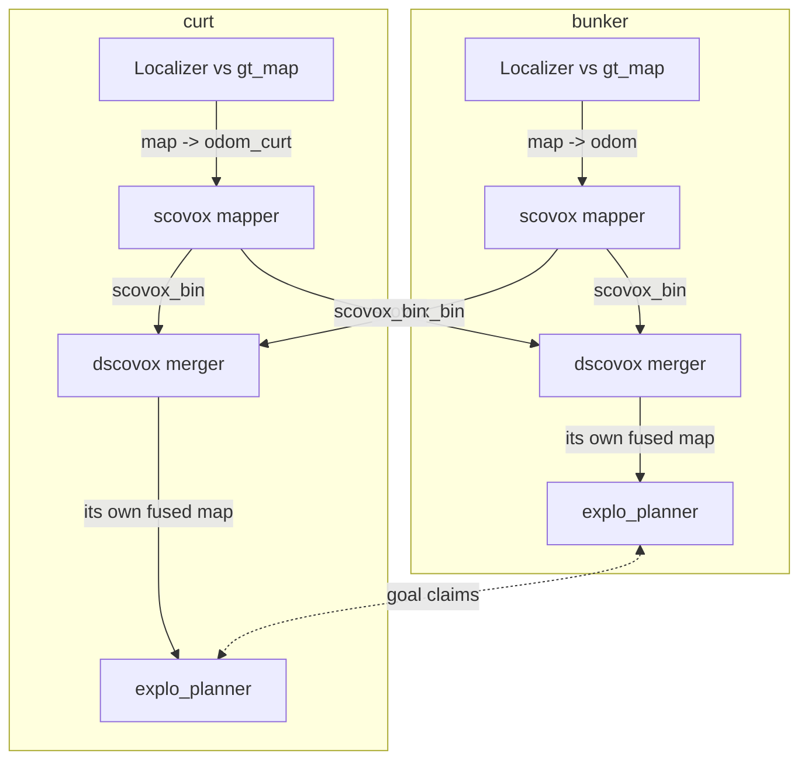

# Explo planner + SCovox on the Jetson: runtime results

As of 2026-09-29. Dev Jetson Orin, 12 cores. All runs open loop on the two
120 s localisation bags (`bunker_jetson`, `curtmini_jetson`).

## Summary

The first simultaneous two-robot run (`dual_r1`, 2026-09-29) worked: both
mergers fused both robots' maps, the planners coordinated, and neither
localizer diverged. Per-robot mapper cost was the same as in the single-robot
pinned runs.

| Date | Run | Robots | Runs | Outcome |
| --- | --- | --- | --- | --- |
| 2026-09-29 | `dual_r1` | bunker + curt together | 1 | Works; fusion `sources=2`, coordination active, 0 divergences |
| 2026-09-18 | `pin_*`, `pin1_*` | bunker or curt, one at a time | 12 | Mapper within budget; repeats agree to about 1% |
| 2026-09-13 | `explo_curt*` | curt only | 3 | Planner works; SCovox 18x over budget at res 0.10, localizer diverged 8 times |

- **Running two robots does not slow either mapper.** bunker's scovox frame p50
  was 88.9 ms (single-robot `pin1`: 87.2 ms), curt's 71.5 ms (69.6 ms).
- **bunker integrates only about 7.6 of its 10 Hz scans, alone or with curt.**
  Its p95 frame (about 104 ms) sits just over the 100 ms budget. curt keeps up
  at 10 Hz.
- **The planner is cheap.** Plan time is 175–250 ms per step and average CPU is
  0.07 cores. The average only reflects the open-loop duty cycle.
- **The dual run changed the DDS as well as the robot count**: FastDDS over
  shared memory, against CycloneDDS over UDP in the pinned runs. CPU
  differences between the two are not attributable to the second robot alone.

## Two-robot setup

Each robot runs its own full stack, and the only things crossing between robots
are the mappers' binary map deltas and the planners' goal claims, as over a
real radio link. Runner: [`ws/src/run_explo_dual_native.sh`](../ws/src/run_explo_dual_native.sh),
a native port of the Docker-only `run_explo_dual.sh` (this box has no Docker
images and none of the original raw bags).



Per robot (namespaced `/bunker` and `/curt`):

1. `lidar_localization` (SMALL_VGICP against the shared `gt_map_us050`)
   publishes `map -> odom_R`, with an identity static `odom_R -> base_R`.
2. `scovox_node` (rolling mode, res 0.20, full-ray carve, deskew on, config
   `bunker_jetson.yaml`) integrates into its own identity alias of `map`
   (`map_int_R`), which becomes its source key in the mergers.
3. `dscovox_node` subscribes to **both** robots' `scovox_bin` streams, so each
   robot holds its own fused copy of the world.
4. `explo_planner_R` reads only its own robot's merger, with
   `coordination_enabled` so it sees the other robot's claimed goal.

**One clock.** The two bags were recorded 1626.677 s apart, and only one player
may publish `/clock`. [`ws/src/restamp_bag_onto.py`](../ws/src/restamp_bag_onto.py)
shifts the bunker bag onto curt's timeline: log times, header stamps, TF, and
the Hesai per-point `timestamp` field, which holds absolute times. After the
shift both bags start on the same nanosecond; the geometry bytes were checked
identical. curt drives `/clock`; both play at rate 1.0.

```bash
B=~/jetbot-slam/hmr_localisation/bags
python3 ws/src/restamp_bag_onto.py $B/bunker_jetson $B/curtmini_jetson $B/bunker_jetson_on_curt_clock
ws/src/run_explo_dual_native.sh dual_r1          # DDS=cyclone for CycloneDDS
```

**DDS.** FastDDS with `hmr_localisation/config/fastdds_shm.xml`: shared-memory
transport, 64 MB segment. The pinned single-robot runs used CycloneDDS over UDP.

**Pinning** (12 cores; both bag players share cores 10–11):

| Robot | Localizer | scovox | dscovox | planner |
| --- | --- | --- | --- | --- |
| bunker | 0–1 | 2 | 3 | 4 |
| curt | 5–6 | 7 | 8 | 9 |

**Open loop.** Each robot replays its recorded path; the planners' goals are
never followed. The runs test candidate generation, scoring, fusion and
coordination, not goal quality.

## Two-robot results (dual_r1)

Both robots mapped, fused and planned for the full 120 s with no localization
divergence. One run; no repeats yet.

| Measure | bunker | curt |
| --- | --- | --- |
| Scans integrated | 905 in 118.9 s (7.60 Hz of 10) | 1183 in 118.0 s (10.02 Hz) |
| scovox frame p50 / p95 / max (ms) | 88.9 / 104.7 / 153.7 | 71.5 / 102.4 / 244.8 |
| Merger fused voxels (of contributed) | 1.11 M (of 1.59 M) | 1.07 M (of 1.54 M) |
| Planner steps | 6 | 5 |
| Plan time p50 / max (ms) | 200 / 225 | 224 / 250 |
| Planner observed voxels, last step | 223 k | 223 k |
| Localizer (cores avg, peak RSS MB) | 1.05, 252 | 1.11, 228 |
| scovox (cores avg, peak RSS MB) | 0.84, 320 | 0.84, 235 |
| dscovox (cores avg, peak RSS MB) | 0.28, 350 | 0.31, 314 |
| Planner (cores avg / peak, peak RSS MB) | 0.07 / 0.62, 309 | 0.07 / 0.53, 303 |
| Localization divergences | 0 | 0 |

**Fusion.** Both mergers reported `sources=2` from the first diagnostic onward.
Contributed voxels exceed fused voxels by about 30%: the two maps land on the
same cells, so they are co-registered in one `map` frame.

**Coordination.** At step 0 neither planner had seen the other (`peers=0`), and
they picked goals 0.4 m apart. From step 1 both saw `peers=1` and rejected
candidates the other had claimed (`blk` up to 33 per step for bunker). The
goals then split: bunker's moved west, from (7.6, −2.4) to (−1.5, 0.2), and
curt's north, from (7.9, −2.6) to (9.8, 7.8).

**Memory.** The two-robot stack peaked at about 2.3 GB RSS across the eight
nodes.

## Against the single-robot pinned runs

Per-robot mapping cost in the dual run matches the later single-robot round
(`pin1`) within about 2 ms of frame time. The merger's CPU fell by more than
half even though it now folds two streams; the DDS change is the likely cause,
but this has not been isolated.

The pinned runs (2026-09-18, runner [`ws/src/run_explo_pinned.sh`](../ws/src/run_explo_pinned.sh))
ran one robot at a time, 3 repeats per bag per round, CycloneDDS over UDP.
Repeats agreed to about 1%, so `pin` and `pin1` are 3-run means; `dual` is a
single run.

| Measure | bunker pin | bunker pin1 | bunker dual | curt pin | curt pin1 | curt dual |
| --- | --- | --- | --- | --- | --- | --- |
| Scans integrated (Hz of 10) | 7.14 | 7.65 | 7.60 | 9.43 | 9.99 | 10.02 |
| scovox frame p50 (ms) | 95.6 | 87.4 | 88.9 | 75.2 | 69.6 | 71.5 |
| scovox frame p95 (ms) | 125.1 | 104.1 | 104.7 | 110.3 | 111.5 | 102.4 |
| Localizer (cores) | 1.38 | 0.90 | 1.05 | 1.41 | 0.87 | 1.11 |
| scovox (cores) | 0.93 | 0.89 | 0.84 | 0.91 | 0.81 | 0.84 |
| dscovox (cores) | 0.76 | 0.77 | 0.28 | 0.61 | 0.61 | 0.31 |
| Planner steps | 4 | 4 | 6 | 5 | 5 | 5 |
| Planner observed voxels, last step | 156 k | 159 k | 223 k | 201 k | 211 k | 223 k |
| Localization divergences | 0 | 0 | 0 | 0 | 0 | 0 |

- **bunker's 7.6 Hz is not caused by the dual setup.** With two scovox cores
  and one robot, `pin1` admitted the same 7.65 Hz.
- **Each planner sees more map in the dual run** (223 k observed voxels,
  against 159 k and 211 k alone), because its merger holds both robots'
  contributions.
- **The localizer used 17–28% more CPU** than in `pin1`. The DDS and the
  second localizer changed at once, so this cannot be pinned on either.
- **`pin` and `pin1` differ** (localizer 1.4 against 0.9 cores; bunker frame 96
  against 87 ms). The change between the two rounds is not recorded in the
  output files.

## Earlier CURT-only run (2026-09-13)

The first explo_planner + SCovox run showed the planner working but SCovox
running 18x over its real-time budget. Its numbers do not compare with the
later rounds: finer map, an NDT localizer that diverged, no core pinning.
Full write-up: [explo_curt_first_run_2026-09-13.md](explo_curt_first_run_2026-09-13.md).

| Measure | Value |
| --- | --- |
| Runs | 3 (`explo_curt`, `explo_curt2`, `explo_fast`), 120 s each |
| Map resolution | 0.10 m (later rounds: 0.20 m) |
| scovox frame, mean | 1855 ms against a 100 ms budget |
| Plan steps | 5 per run |
| Plan time | 250 to 750 ms, still growing at 120 s |
| Planner CPU | about 1.08 cores while planning, peak 1.52; idle otherwise |
| Localizer | NDT, diverged 8 times (TF jumps of 1.5 to 6.1 m) |
| Clouds reaching scovox | 312 of about 1155 (DDS dropped about 73%) |

Two wiring traps from that run, which the later runners avoid:

- `explo_planner` main does not build against scovox main, because
  `RefinementRegion.msg` is missing. A local reconstruction is in use.
- The planner's map subscription only matches the merger (`dscovox_node`), not
  `scovox_node` directly, so the committed `exploration_fused_bag.yaml` default
  is unusable.

## Caveats and next steps

The dual result is one run on one DDS: it shows the setup works, but is not yet
a measurement to quote.

- **Single run.** The pinned rounds repeated to about 1%; the dual run has no
  repeats yet.
- **DDS confound.** Dual used FastDDS SHM, pinned used CycloneDDS UDP. Rerunning
  the dual with `DDS=cyclone` needs `net.core.rmem_max` >= 10 MB (sudo; resets
  on reboot).
- **Open loop.** Goal quality and closed-loop replanning cost are untested.
- **Localisation bags, not exploration bags.** Each covers 120 s of a short
  localisation walk.
- **Disk.** The restamped bunker bag is 6.2 GB uncompressed.

Next:

- [ ] Repeat `dual` 3 times for a spread comparable to the pinned rounds
- [ ] Run single-robot `pin1` on FastDDS, to separate the DDS effect from the second robot
- [ ] Find what changed between `pin` and `pin1`
- [ ] Recompress the restamped bunker bag (about 1.2 GB with zstd)

## Where things are (on the Jetson)

| What | Path |
| --- | --- |
| Dual run outputs | `~/explo-output/dual/dual_r1_*` |
| Pinned run outputs | `~/explo-output/pinned/` |
| First run outputs | `~/explo-output/explo_curt*`, `explo_fast*` |
| Dual runner | `ws/src/run_explo_dual_native.sh` |
| Bag restamper | `ws/src/restamp_bag_onto.py` |
| Pinned runner + summary | `ws/src/run_explo_pinned.sh`, `ws/src/explo_pin_summary.py` |
| Restamped bunker bag | `~/jetbot-slam/hmr_localisation/bags/bunker_jetson_on_curt_clock` |
