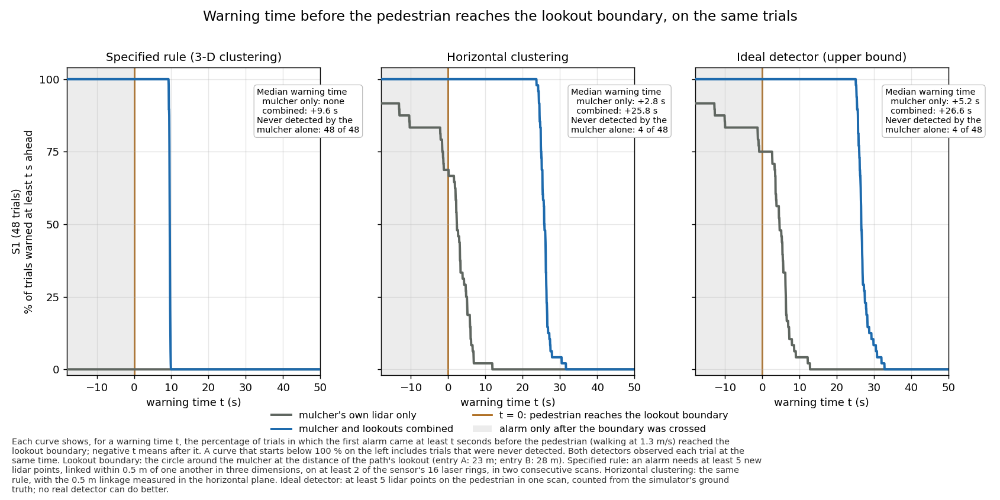
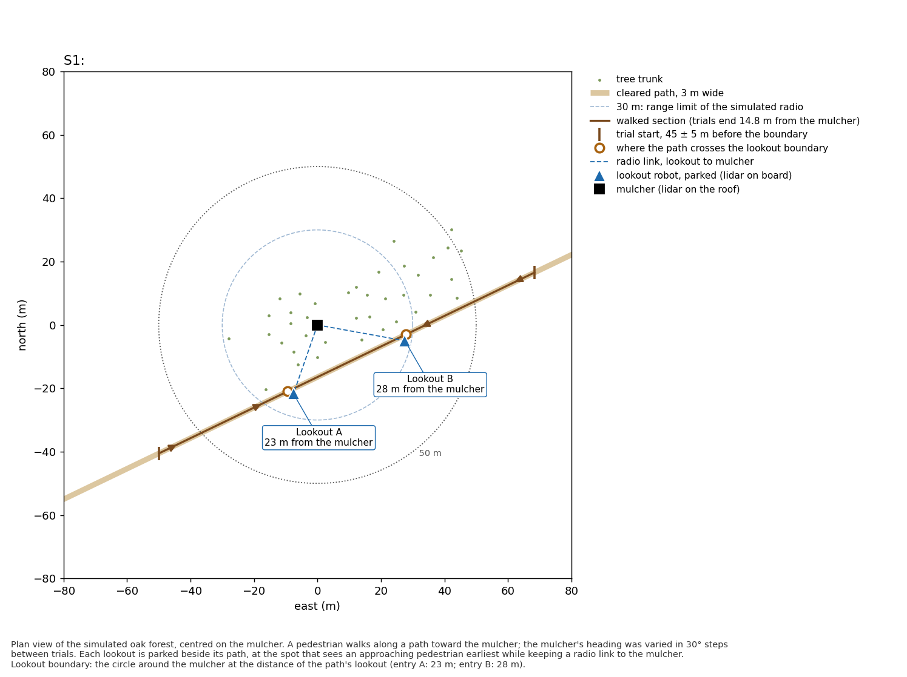

# Site lookouts

The path-lookout experiment (`../lookout`) repeated on the tree layout of a
real site: the `gt_map` of `hmr_localisation`, inside the explorer's region
of interest. Simulated experiment (Ignition Gazebo, Fortress), 2026-09-25.
The plan, written before any walk, is in [PLAN.md](PLAN.md); the generated
numbers in [results/results.md](results/results.md).

## Answer

Yes. Under the specified detection rule, the mulcher parked among the trees
never detected a walker on the path (0 of 48). With the two lookouts, every
walker was detected before the lookout boundary (48 of 48; McNemar exact
p = 7e-15), with a median warning of 9.6 s. Under the two looser rules,
which the mulcher can also meet, the first alarm came a median 22-23 s
earlier with the lookouts than without them, on the same walk.

| | mulcher alone | mulcher and lookouts |
|---|---|---|
| detected before the lookout boundary, specified rule | 0 / 48 | 48 / 48 |
| detected before the lookout boundary, horizontal clustering | 33 / 48 | 48 / 48 |
| detected before 50 m, horizontal clustering | 0 / 48 | 48 / 48 |
| median warning before the boundary, horizontal clustering | 2.8 s | 25.8 s |
| distance at the first alarm, horizontal clustering (median) | 26.3 m | 55.5 m |
| first alarm earlier with lookouts, same walk (median; least), horizontal clustering | | 23.1 s; 13.5 s |
| first alarm earlier with lookouts, same walk (median; least), ideal detector | | 22.3 s; 12.7 s |
| false alarms, every lidar | 0 | 0 |



What the numbers mean:

- **The mulcher's 0 of 48 under the specified rule follows from the
  layout.** The rule cannot fire beyond about 12.5-14 m (open-ground
  calibration of the lookout experiment), and the path passes 14.8 m from the
  mulcher at its closest, where the walks end. This was expected before the
  first walk (PLAN.md). The looser rules give the comparison that does not
  depend on this.
- **Each lookout covers its own end of the path.** Lookout A raised the
  first alarm in all 24 walks from the west, lookout B in all 24 from the
  east. Without one of them, half of the walkers are detected late.
- **The mulcher's blind side.** Under horizontal clustering the mulcher
  missed 4 of the 8 walks that came in within 30 degrees of its front, where
  the cutting head blocks its lidar; it detected all 40 others.
- **The trees hardly matter to the mulcher.** A check made after the results: the mulcher's 12 check
  walks repeated with every tree removed. Under the specified rule it detected no one either way. Under
  the looser rules its first detection came at the same distance in 8 of 11 walks, 0.5-0.9 m further
  out in 2, and 4-7 m further out in 1; it missed the same walk (in its blind wedge). Its limit is the
  lidar's range for a person and the cutting head, not the trees.
- **The real site blocks more than the oak models, from the east.** A second check made after the
  results: the same 12 walks with the oak models replaced by the map's own points (5 cm voxels, flat
  ground). The mulcher still detected the same 11 of 12 walks under the looser rules, and none under
  the specified rule, but in the walks from the east its first detection came a median 4.6 m
  (horizontal clustering) or 5.8 m (ideal detector) closer than among the oak models.
- **The result holds with a published moving-object detector.** A check made after the results, with
  M-detector (Wu et al., 2024) as every lidar's detector, in the oak-model world and the map-point world:
  the mulcher alone detected 18 and 16 of 48 walkers before the lookout boundary (median warning -1.7 and
  -4.0 s); with the lookouts, 48 of 48 (median 24.6 and 25.0 s), a median 25.6 and 28.7 s earlier on the
  same walk. No false alarms in simulation (on a real recording it raised many). The same check on the
  lookout experiment's layouts L2 and L3 gave the same answer; all four worlds are in
  [mdetector/README.md](mdetector/README.md).
- **The lookouts change nothing for the mulcher.** In the 12 check walks
  without lookouts (moved 1 km away, and never spawned) the mulcher's first
  detection fell on the same walk step as with them, in 12 of 12 both ways.

## Set-up

- **Trees:** 38 trees found in the map (`trees.py`: highest point above the
  ground per 0.5 m cell; peaks at least 3 m high and 3.5 m apart), all as our
  oak model, each scaled to its measured height (4.8-21.9 m) and crown radius
  (1.4-4.5 m). Flat ground; no walls, fences or bushes.
- **Mulcher** at map (-2, 0.6), among the trees; body and head boxes, lidar
  on the roof at 2.1 m, turned through 12 headings.
- **Path:** one straight path along the south side of the tree band (next to
  the tree formerly labelled pine_9), 3 m wide, 3.3 m from the nearest trunk,
  passing 14.8 m from the mulcher. Walkers enter from either end.
- **Lookouts** placed by the lookout experiment's rule (`posts.py`): the
  free spot 12-28 m out beside the path, with a radio link to the mulcher,
  that sees an approaching walker earliest: 23 m (west) and 28 m (east).
- **Everything else as in the lookout experiment:** lidar (VLP-16 model,
  0.5-100 m, 2 cm noise), detection rules and thresholds, walker and walks
  (48 walks, 24 check walks), calibration, and the same code
  (`../lookout`), run in the same environment.



## Limits

- The site is reduced to its trees: flat ground, no walls, fences, bushes
  or slope, and trees only inside the region of interest.
- Tree positions and sizes come from the map automatically; where crowns
  touch, one tree may have been split or two merged. All trees are one oak
  model, stretched.
- One path, straight, chosen as the lane beside the tree rows; walkers keep
  to it and stop at its closest point to the mulcher.
- The radio model and the lidar are the lookout experiment's, not measured
  at this site.
- One layout; walks share headings and entries, so the intervals in
  `results/results.md` are approximate.

## Files

| file | what |
|---|---|
| `build_site_world.py` | ground and object meshes from the map; the region of interest (`ROI_*`) |
| `trees.py` | trees found in the map (`runs/site_lookout/world/trees.csv`) |
| `layout.py` | first layout with two paths (for viewing) |
| `no_trees.py`, `gtmap_world.py` | checks after the results: S1 without trees (S1N), and with the map's own points in place of the oaks (S1G) |
| `build_layout.py` | layout S1: config `config/S1.yaml`, world and trunk list in `runs/site_lookout/worlds/` |
| `docker_run.sh` | runs the lookout code in the lookout experiment's environment, with S1 overlaid |
| `view.sh` | opens a world in the Gazebo window |
| `register_frames.py`, `grab_frames.py`, `probe*.py`, `capture.py` | real lidar frames from the July bags, registered to the map (sim-versus-real check, not finished) |
| `mdetector/` | check after the results: M-detector as every lidar's detector, in S1, S1G, L2 and L3 (own README) |
| `run_md_sims.sh` | S1 and S1G walks with whole scans saved, for M-detector |
| `results/` | analysis output and go/no-go checks |

`../lookout/analyse.py` was changed for this layout only in how it prints
(no detection by the mulcher, the walk end and boundary distances in the
figure notes); its numbers for L2 and L3 are unchanged.

## Reproduce

```bash
# from the repository root; needs ../lookout_experiment (its ws build and runs/lookout)
docker run --rm --network none -u $(id -u):$(id -g) -v $PWD:/p -w /p hmrexplo:humble \
  python3 experiments/site_lookout/build_site_world.py --ply ws/src/hmr_localisation/gt_map/gt_map.ply --out runs/site_lookout/world
docker run --rm --network none -u $(id -u):$(id -g) -e MPLCONFIGDIR=/tmp -v $PWD:/p -w /p hmrexplo:humble \
  python3 experiments/site_lookout/trees.py ws/src/hmr_localisation/gt_map/gt_map.ply runs/site_lookout/world
docker run --rm --network none -u $(id -u):$(id -g) -v $PWD:/p -w /p hmrexplo:humble \
  python3 experiments/site_lookout/build_layout.py runs/site_lookout/world/trees.csv runs/site_lookout/worlds
LOOKOUT_GPU=1 experiments/site_lookout/docker_run.sh site_S1 83 /lookout/run_layout.sh S1 /runs/site_lookout/S1_full full
experiments/site_lookout/docker_run.sh site_an 84 python3 /lookout/analyse.py \
  --layout S1=/runs/site_lookout/S1_full --calib /runs/lookout/calib_gpu --out /runs/site_lookout/results
```

The full run took about 15 min (NVIDIA GPU). Raw logs are in
`runs/site_lookout/` (not tracked).
