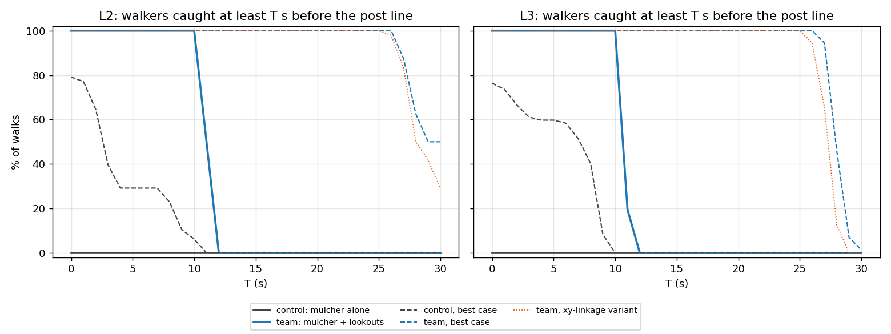
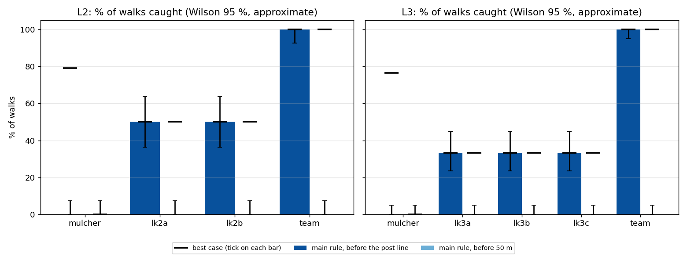

# Path lookouts

Do robots parked on the paths into a mulching site warn the mulcher of a
walker earlier than the mulcher's own lidar? Simulated in Ignition Fortress,
2026-09-23/24. The plan, the full status log and every deviation from the
brief are in [PLAN.md](PLAN.md); the generated numbers in
[results/results.md](results/results.md).

## Answer

Yes: the first alarm came about 22 s earlier (never less than 20 s). With
the detection rule as written, the mulcher alone raised its first alarm when
the walker was about 14 m away, always after the walker had crossed the post
line (24-28 m). With the lookouts, every walker was caught before the post
line, about 40 m out.

| | L2 (2 lookouts, 48 walks) | L3 (3 lookouts, 72 walks) |
|---|---|---|
| mulcher alone: caught before the post line | 0 / 48 | 0 / 72 |
| mulcher + lookouts: caught before the post line | 48 / 48 (93-100 %) | 72 / 72 (95-100 %) |
| median warning before the post line: mulcher alone / team | -12.5 s / 11.0 s | -11.2 s / 10.8 s |
| first alarm, team vs mulcher alone, same walk (median; least) | 23.1 s earlier; 20.0 s | 21.9 s earlier; 21.5 s |
| walker's distance from the mulcher at the first alarm (median): mulcher / team | 13.9 m / 39.4 m | 13.7 m / 41.7 m |
| walks the mulcher alone never caught (walk ends 10 m out) | 4 | 18 |
| caught before 50 m, anyone | 0 | 0 |
| false alarms, every lidar | 0 | 0 |

Main rule: the brief's rule as written. Warning = time from the first alarm to
the walker crossing the post line (negative: after crossing). Intervals are
Wilson 95 %, and approximate, because walks share headings and entries.
McNemar exact, team vs mulcher alone, caught before the post line: p = 7e-15
(L2), 4e-22 (L3).



What the numbers mean:

- **The mulcher's 0 % is partly built in.** The main rule links returns in 3D
  at 0.5 m; the lidar's rings are 2 deg apart, so beyond ~14.3 m no cluster
  spans the two rings the rule needs. It cannot fire past ~14 m from any
  lidar (open-ground calibration: 12.5 m for every mount), and every post
  line is further out than that. The same ceiling is why nobody, mulcher or
  lookout, is caught before 50 m under the main rule: a lookout 28 m out sees
  a walker at ~42 m. The paired time gain (~22 s) is the fairer measure.
- **With looser rules the mulcher does better, the lookouts still more.**
  Two sensitivity rules were declared before any walk: `xy5` (the same rule,
  0.5 m linkage in the horizontal plane) and a best case (>= 5 returns in the
  person's box, from ground truth). The mulcher alone then catches 54-79 % of
  walkers before the post line, with a median warning of 1-8 s; the team
  catches all of them, before 50 m too, with 27-29 s. Best case, same walk:
  the team's first alarm 26.5 s (L2) and 20.4 s (L3) earlier.
- **The mulcher's blind side.** Every walk the mulcher alone never caught
  came in within 45 deg of its front, where the cutting head blocks 15 of its
  16 lidar channels (bearing measured with the walker 20 m out). In L3 it
  missed all 18 walks that came in within 39 deg of the front. The lookouts
  caught all of them.
- **Each lookout covers one entry.** In every walk, the lookout on the
  walker's own path raised the first alarm (24 walks each). Take one lookout
  away and its path's walkers are caught only by the mulcher: L3 without any
  one lookout catches 67 % before the post line.
- **The lookouts change nothing for the mulcher.** Check walks repeat 12
  walks per layout without the lookouts (moved 1 km away, and in a sim where
  they were never spawned). The mulcher's first alarm fell on the same walk
  step in 23 of 24 per layout, and within one step (0.5 m, the lidar noise)
  in all 24.



## Limits

- **The lookouts watch the paths, and every walker used one.** A walker
  coming through the trees away from a path would not pass a lookout; that
  was not tested.
- **The posts depend on the radio model.** Posts are at most 28 m out because
  the comms model has a hard 30 m horizon and 70 dB per trunk
  (`hmr_sim/src/hmr_comms_sim_node.cpp`). These are stress settings, not
  measured radio: a real link could allow posts further out (more warning) or
  fail to reach these. Every post was linked in the model, and every lookout
  alarm was raised on a linked post; the radio model was not changed.
- **lk2b is at 24 m, not 28 m,** because every free spot from 24.5 to 28 m on
  either side of that path has a trunk within 3.7 m. Its path's post line is
  therefore 24 m.
- **The lookouts are parked, static, on known posts.** The posts are
  calculated from a perfect map (the world's trunk list); in a real mission
  the robots would explore first and drive out, which is out of scope. They
  are static models: a parked Husky rocks in this simulator (below), which a
  real one on real ground may or may not do.
- **An idealised walker and forest.** One mid-stride person mesh (1.74 m)
  moved in 0.5 m steps at 1.3 m/s along the path (offsets up to 5 m along,
  0.5 m across), trunks only (no branches, canopy or undergrowth), flat
  ground, Gaussian 2 cm range noise, ground-truth lidar poses.
- **Two layouts, one forest each.** The intervals treat walks as independent;
  they are not (12 headings, 2-3 entries, 2 repeats), so read them as rough.

## Setup

- **World:** oak forest (flatforest v2 density), 160 m radius, 3 m lanes
  cleared along the paths; L2 one path through the site (two entries), L3
  three paths. Mulcher: static body and head boxes to the brief's
  dimensions, a VLP-16 on the roof at 2.1 m.
- **Lidar:** VLP-16 model, 0.5-100 m, 2 cm noise, 1800 x 16, 10 Hz, on every
  robot.
- **Posts** (`posts.py`, PLAN.md "Lookout placement"): for each entry, the
  free spot 12-28 m out, beside the path, with a safe radio link, from which a
  walker is first in view (within 12.5 m, no trunk in the way) furthest from
  the mulcher. L2: 28 m and 24 m; L3: 28 m each.
- **Walks:** per layout, 12 mulcher headings (0-330 deg) x each entry x 2
  repeats, each starting 45 m (+-5 m) before the post line and ending 10 m
  from the mulcher. The world is paused; the walker is moved a step, the
  world stepped one lidar period, and the first scan from every lidar
  rendered after the move is used.
- **Detection** (`detect.py`, the brief's Part 4): background median over 10
  scans; a return is new if >= 0.3 m closer; clusters at 0.5 m; alarm = >= 5
  points on >= 2 rings, persisting 2 steps within 1 m; a hit is within 1 m of
  the walker. Team = the earliest alarm of the mulcher and the lookouts; a
  lookout's alarm counts at once (its post is linked).

## Problems found on the way

- **Parked Huskies rock** (DART with the bullet collision detector): the
  cylinder-wheel contact tipped a settled Husky 0.5 deg in one step, which
  turned thousands of ground returns "new" and gave hundreds of false-alarm
  scans. Ten Huskies on empty flat ground did the same; with the ode detector
  none moved. Fix: the lookouts are spawned static at the settled height
  (`spawn_static.py`); lidar height unchanged (0.848 m).
- **Removing a lidar model crashes Gazebo Fortress** (ogre2 assert), so the
  check walks could not run as planned (lookouts removed). They were run two
  ways instead: lookouts moved 1 km away, and a fresh sim without them.
- **Stale scans with a single lidar:** in the check walks (mulcher only) the
  scan taken for a step was the previous step's. Fixed by also requiring a
  scan stamped after the step began (`scans.py`); the affected walks were
  re-run. An audit of every scan in the final data finds none stale
  (`smoke/stale_audit.py`: 0 of ~30 500 lidar-steps).
- **Analysis and checks:** `analyse.py` now counts only the session that
  finished each walk, and compares walk steps, not rounded times. `gonogo.py`
  now accepts the lookouts' columns being empty in the check walks, which run
  without them (approved after the full runs). Go/no-go on the full runs:
  GO (`runs/lookout/gonogo_full.txt`).
- Earlier, before any measurement: a /clock-based freshness test passed
  stale scans (replaced by per-lidar stamps), and `ign service` lost ~3 % of
  replies (replaced by a persistent client, `gzsvc.cc`).

Other deviations from the brief (the lookouts no longer drive out or carry
warnings, the posts are calculated from the map, no completed pilot for the
static lookouts, the GPU renderer) are listed with reasons in PLAN.md.

## Reproduce

```bash
# in ~/Documents/lookout_experiment, image hmrexplo:humble
LOOKOUT_GPU=1 lookout/docker_run.sh lk_L2 42 /lookout/run_layout.sh L2 /runs/lookout/L2_full full
LOOKOUT_GPU=1 lookout/docker_run.sh lk_L3 43 /lookout/run_layout.sh L3 /runs/lookout/L3_full full
# then, in the container:
python3 /lookout/gonogo.py --layout L2=/runs/lookout/L2_full --layout L3=/runs/lookout/L3_full \
    --calib /runs/lookout/calib_gpu
python3 /lookout/analyse.py --layout L2=/runs/lookout/L2_full --layout L3=/runs/lookout/L3_full \
    --calib /runs/lookout/calib_gpu --out /runs/lookout/results
```

One layout at a time: on this machine two sims in parallel are no faster. L3
took 3.6 h, L2 about 2 h plus re-runs (NVIDIA GPU, headless EGL). Raw per-scan logs are in
`runs/lookout/` (not tracked); `results/` here is a copy of the analysis
output, and `data/` holds the logs it reads (see `data/README.md`).
